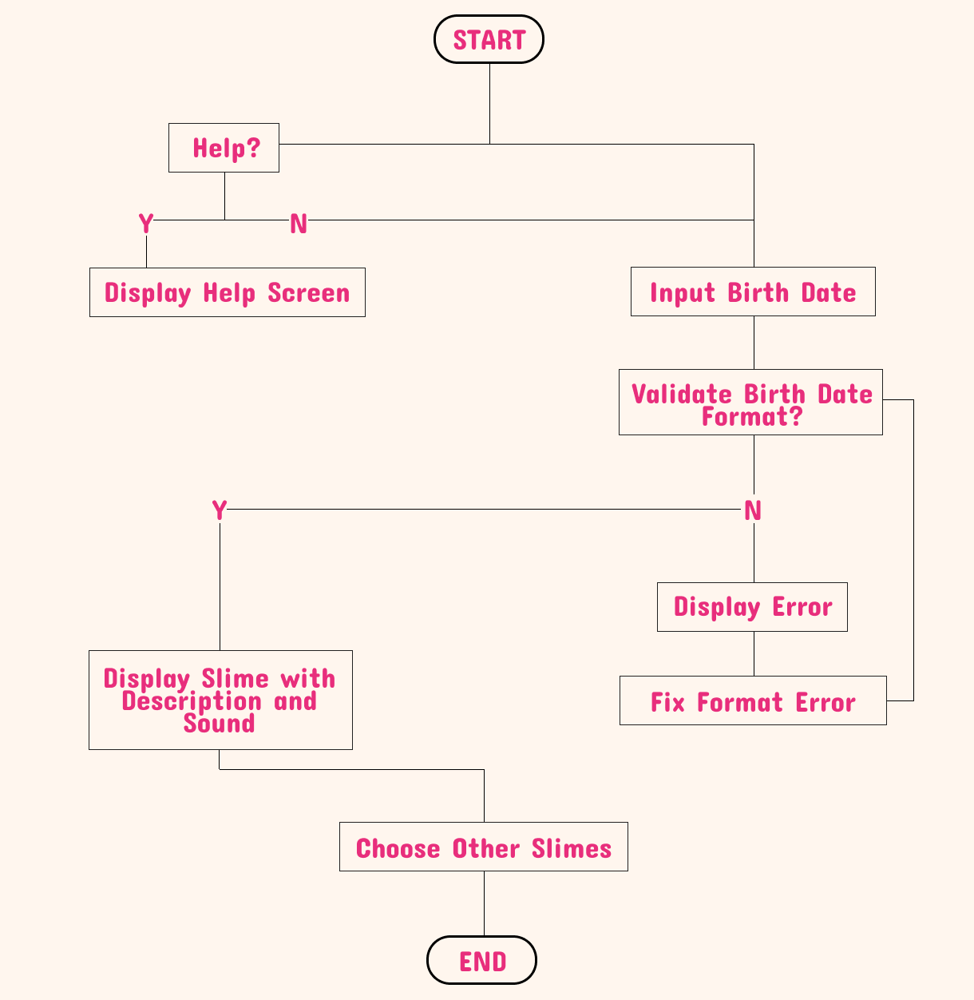
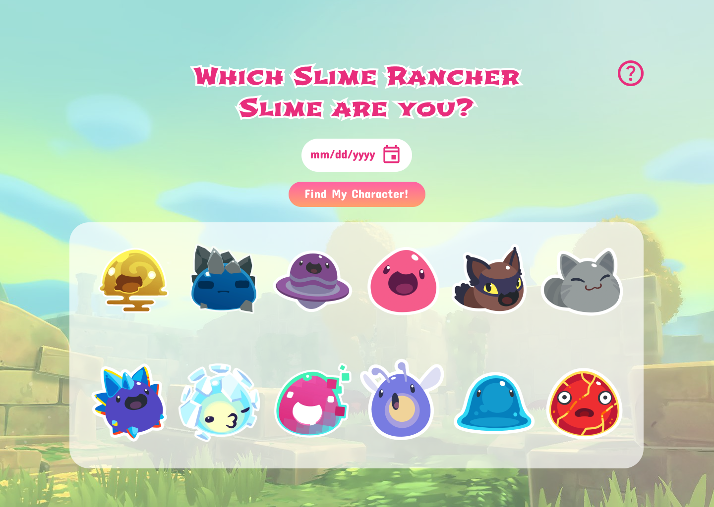
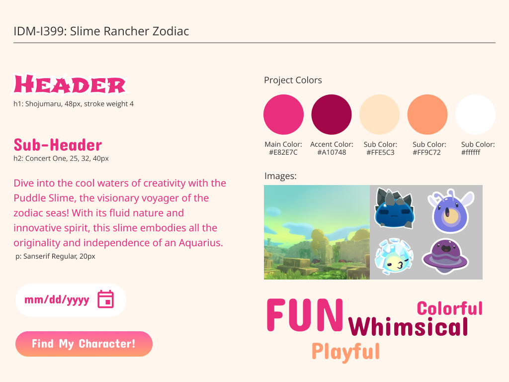

Figma Link: https://www.figma.com/file/bduRw6ZPT5vBOjyRX9vOnK/IDM-I399-Scripting?type=design&t=OyIQR5KVG4GWrgAt-6

Google Doc: https://docs.google.com/document/d/13GRyHG9ZbuMXRSkKDi--jq-QVZZLJTx-H7YDkllCKRo/edit
- infomation on which slimes are assigned to which dates 
- sound ideas 

<h2>Flowchart</h2>

<h2>Wireframe</h2>

<h2>Style Chart</h2>

